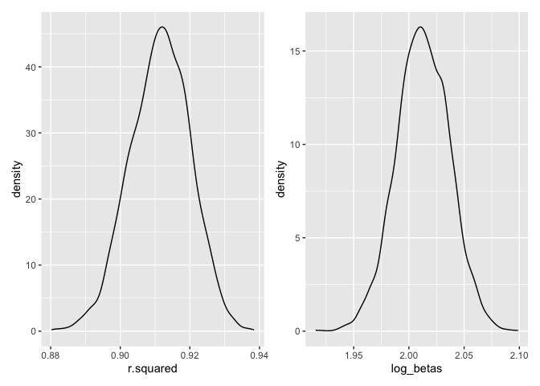
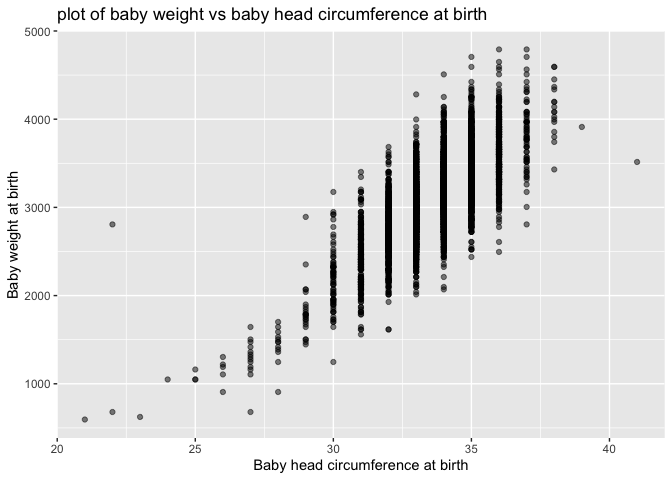
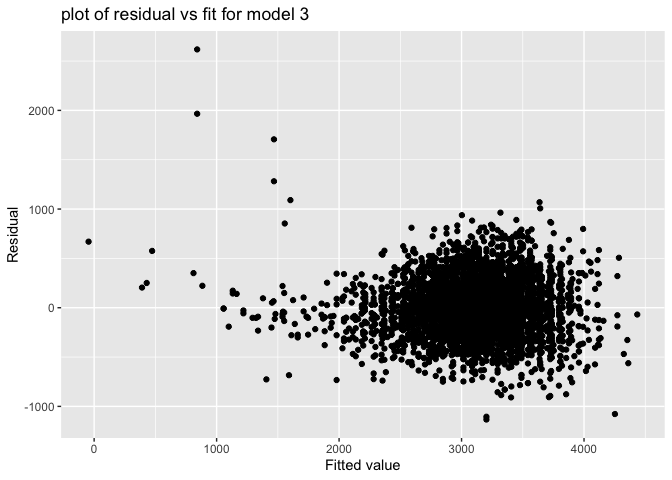
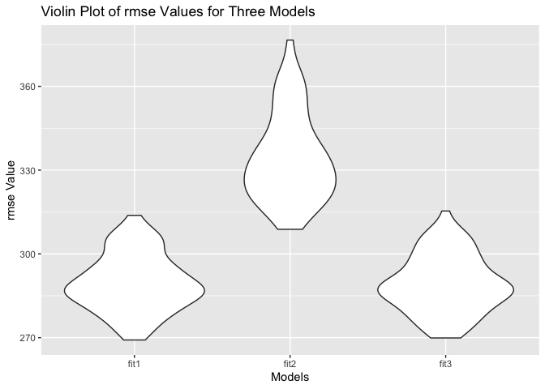

P8105
================
Jiawen Zhao
11/25/2022

## Problem 1

``` r
weather_df = 
  rnoaa::meteo_pull_monitors(
    c("USW00094728"),
    var = c("PRCP", "TMIN", "TMAX"), 
    date_min = "2017-01-01",
    date_max = "2017-12-31") %>%
  mutate(
    name = recode(id, USW00094728 = "CentralPark_NY"),
    tmin = tmin / 10,
    tmax = tmax / 10) %>%
  select(name, id, everything())
```

``` r
weather_df %>% 
  ggplot(aes(x = tmin, y = tmax)) + 
  geom_point() 
```

<!-- -->

## Bootstrapping

``` r
weather_bootstrap1 = 
  weather_df %>% 
  modelr::bootstrap(n = 5000, id = "strap_number") %>% 
  mutate(
    models = map(strap, ~ lm(tmax ~ tmin, data = .x)),
    results = map(models, broom::tidy)) %>% 
  select(strap_number, results) %>% 
  unnest(results) 
weather_bootstrap1
```

    ## # A tibble: 10,000 × 6
    ##    strap_number term        estimate std.error statistic   p.value
    ##    <chr>        <chr>          <dbl>     <dbl>     <dbl>     <dbl>
    ##  1 0001         (Intercept)     7.65    0.226       33.8 3.41e-114
    ##  2 0001         tmin            1.00    0.0165      60.8 2.48e-192
    ##  3 0002         (Intercept)     7.07    0.201       35.1 7.95e-119
    ##  4 0002         tmin            1.05    0.0151      69.2 3.66e-211
    ##  5 0003         (Intercept)     7.46    0.213       35.0 3.09e-118
    ##  6 0003         tmin            1.02    0.0161      63.4 1.59e-198
    ##  7 0004         (Intercept)     7.31    0.209       35.1 1.38e-118
    ##  8 0004         tmin            1.03    0.0161      64.4 1.09e-200
    ##  9 0005         (Intercept)     7.59    0.221       34.3 7.68e-116
    ## 10 0005         tmin            1.03    0.0157      65.5 3.52e-203
    ## # … with 9,990 more rows

``` r
weather_bootstrap2 = 
  weather_df %>% 
  modelr::bootstrap(n = 5000, id = "strap_number") %>% 
  mutate(
    models = map(strap, ~ lm(tmax ~ tmin, data = .x)),
    results = map(models, broom::glance)) %>% 
  select(strap_number, results) %>% 
  unnest(results)
weather_bootstrap2
```

    ## # A tibble: 5,000 × 13
    ##    strap_number r.squ…¹ adj.r…² sigma stati…³   p.value    df logLik   AIC   BIC
    ##    <chr>          <dbl>   <dbl> <dbl>   <dbl>     <dbl> <dbl>  <dbl> <dbl> <dbl>
    ##  1 0001           0.912   0.912  3.01   3778. 5.76e-194     1  -919. 1844. 1855.
    ##  2 0002           0.887   0.886  3.08   2842. 9.01e-174     1  -927. 1860. 1872.
    ##  3 0003           0.906   0.906  2.89   3518. 7.36e-189     1  -904. 1814. 1826.
    ##  4 0004           0.916   0.916  2.89   3950. 3.54e-197     1  -904. 1814. 1825.
    ##  5 0005           0.908   0.907  2.90   3570. 6.63e-190     1  -906. 1818. 1830.
    ##  6 0006           0.893   0.893  3.04   3031. 2.81e-178     1  -923. 1851. 1863.
    ##  7 0007           0.917   0.916  2.92   3995. 5.38e-198     1  -908. 1821. 1833.
    ##  8 0008           0.890   0.890  3.13   2939. 4.16e-176     1  -934. 1873. 1885.
    ##  9 0009           0.906   0.906  2.98   3510. 1.06e-188     1  -916. 1837. 1849.
    ## 10 0010           0.915   0.915  2.84   3922. 1.16e-196     1  -897. 1801. 1812.
    ## # … with 4,990 more rows, 3 more variables: deviance <dbl>, df.residual <int>,
    ## #   nobs <int>, and abbreviated variable names ¹​r.squared, ²​adj.r.squared,
    ## #   ³​statistic

``` r
bootstrapplot_r = 
weather_bootstrap2 %>% 
ggplot(aes(x = r.squared)) + geom_density()
```

plot of log(B^0\*B^1)

``` r
weather_bootstrap1_log = 
weather_bootstrap1 %>% 
  select(strap_number, term, estimate) %>%
  pivot_wider(names_from = "term",
            values_from = "estimate") %>%
  rename(b0 = `(Intercept)`) %>% 
  rename(b1 = tmin) %>% 
  mutate(log_betas = log(b0*b1)) 
```

plot of log(b0\*b1)

``` r
bootstrapplot_log = 
  weather_bootstrap1_log %>% 
  ggplot(aes(x = log_betas)) + geom_density()
```

plot of both estimates

``` r
bootstrapplot_r + bootstrapplot_log
```

<!-- -->

95% CI for R^2 and log(b0\*b2)

``` r
weather_bootstrap2 %>% 
  summarize(
    ci_lower = quantile(r.squared, 0.0275),
    ci_upper = quantile(r.squared, 0.975))
```

    ## # A tibble: 1 × 2
    ##   ci_lower ci_upper
    ##      <dbl>    <dbl>
    ## 1    0.894    0.928

The 95% confidence interval for r^2 is between .894 and 0.927.

``` r
weather_bootstrap1_log %>% 
  summarize(
    ci_lower = quantile(log_betas, 0.0275),
    ci_upper = quantile(log_betas, 0.975))
```

    ## # A tibble: 1 × 2
    ##   ci_lower ci_upper
    ##      <dbl>    <dbl>
    ## 1     1.97     2.06

The 95% confidence interval for log(b0\*b1) is between 1.97 and 2.06.

#### Problem 2

``` r
homicide <- read.csv("./data/homicide-data.csv")%>% 
  na.omit() %>% 
  unite(city_state, c(city,state),sep = ", ") %>% 
  mutate(solved = case_when(grepl("Closed by arrest", disposition)==TRUE ~ 1,
  grepl("Closed by arrest", disposition)==FALSE ~ 0)) %>% 
  mutate(unsolved = case_when(grepl("Closed by arrest", disposition)==FALSE ~ 1,
  grepl("Closed by arrest", disposition)==TRUE ~ 0)) %>%
  filter(!city_state %in% c("Dallas, TX", "Phoenix, AZ", "Kansas City, MO", "Tulsa, AL")) %>% 
  filter(str_detect(victim_race, c("White", "Black"))) %>% 
  mutate(victim_age =as.numeric(victim_age))%>% 
  na.omit()
```

    ## Warning in stri_detect_regex(string, pattern, negate = negate, opts_regex =
    ## opts(pattern)): longer object length is not a multiple of shorter object length

    ## Warning in mask$eval_all_mutate(quo): NAs introduced by coercion

``` r
BMD = filter(homicide,city_state=="Baltimore, MD")
fit_logistic = BMD%>% 
  glm(solved ~ victim_age + victim_race + victim_sex, data = ., family = binomial())
fit_logistic %>% 
  broom::tidy(conf.int = TRUE) %>% 
  mutate(OR = exp(estimate), adj.conf.low=exp(conf.low), adj.conf.high=exp(conf.high)) %>%
  select(term, log_OR = estimate, OR, p.value, adj.conf.low, adj.conf.high) %>% 
  knitr::kable(digits = 3)
```

| term             | log_OR |    OR | p.value | adj.conf.low | adj.conf.high |
|:-----------------|-------:|------:|--------:|-------------:|--------------:|
| (Intercept)      |  0.119 | 1.126 |   0.627 |        0.697 |         1.826 |
| victim_age       | -0.003 | 0.997 |   0.508 |        0.988 |         1.006 |
| victim_raceWhite |  0.779 | 2.179 |   0.001 |        1.365 |         3.497 |
| victim_sexMale   | -0.758 | 0.469 |   0.000 |        0.319 |         0.688 |

``` r
exp(summary(fit_logistic)$coefficients["victim_sexMale",1] + qnorm(c(0.025,0.5,0.975)) * summary(fit_logistic)$coefficients["victim_sexMale",2])
```

    ## [1] 0.3193133 0.4687305 0.6880650

Keeping all other variables fixed, the estimate of the adjusted odds
ratio for solving homicides comparing male victims to female victims is
0.4687305, with confidence interval of (0.3193133, 0.6880650).

``` r
city_fit_glm = 
  homicide %>%
  nest(data = -city_state) %>% 
  mutate(model = map(data, ~glm(solved~victim_age + victim_race + victim_sex, data = ., family = binomial())),
         result = map(.x=model, ~broom::tidy(.x,conf.int = TRUE))) %>% 
  select(city_state,result)%>% 
  unnest(result)%>% 
  mutate(OR = exp(estimate), adj.conf.low=exp(conf.low), adj.conf.high=exp(conf.high)) %>%
  select(city_state,term, log_OR = estimate, OR, p.value, adj.conf.low, adj.conf.high) %>% 
  filter(term == "victim_sexMale")
```

``` r
city_fit_glm%>%
  mutate(
    city_state = fct_reorder(city_state, -OR)
  ) %>%
  ggplot(aes(x = OR, y = city_state)) +
  geom_point() +
  geom_errorbar(aes(xmin = adj.conf.low, xmax = adj.conf.high)) +
  ylab("City, state") +
  xlab("Odds ratio") +
  labs(title = "Adjusted odds ratio of solved cases for male and female victims")
```

<!-- -->

Based on the plot, we can see that Long Beach CA has the lowest
estimated OR for male and female victims, which means the case solve
rate is not too different between males and females, and Stockton, CA
has the highest OR for male and female victims, which means the case
solve rate is very different between males and females. Also, we see
that for most of the cities, the distribution of estimated OR is right
skewed.

# Problem 3

``` r
birthweight <- read.csv("./data/birthweight.csv")%>% 
  na.omit() %>% 
  mutate(
    babysex = factor(babysex, levels = c("1", "2"), labels = c("male", "female")),
    frace = factor(frace, levels = c("1", "2", "3", "4", "8", "9"), labels = c("white", "black", "asian", "puerto rican", "other", "unknown")), 
    malform = factor(malform, levels = c("0", "1"), labels = c("absent", "present")),
    mrace = factor(mrace, levels = c("1", "2", "3", "4", "8"), labels = c("white", "black", "asian", "puerto rican", "other")))
  
birthweight %>% 
  ggplot(aes(x = bhead, y = bwt)) + 
  geom_point(alpha = .5)+
  ylab("Baby weight at birth") +
  xlab("Baby head circumference at birth") +
  labs(title = "plot of baby weight vs baby head circumference at birth")
```

<!-- -->

``` r
birthweight %>% 
  ggplot(aes(x = blength, y = bwt)) + 
  geom_point(alpha = .5)+
  ylab("Baby weight at birth") +
  xlab("Baby length at birth") +
  labs(title = "plot of baby weight vs baby length at birth")
```

<!-- -->

``` r
fit1 = lm(bwt ~ bhead+blength, data = birthweight)
summary(fit1)
```

    ## 
    ## Call:
    ## lm(formula = bwt ~ bhead + blength, data = birthweight)
    ## 
    ## Residuals:
    ##      Min       1Q   Median       3Q      Max 
    ## -1116.99  -185.71    -8.95   182.38  2677.29 
    ## 
    ## Coefficients:
    ##              Estimate Std. Error t value Pr(>|t|)    
    ## (Intercept) -6029.620     95.821  -62.93   <2e-16 ***
    ## bhead         146.021      3.489   41.85   <2e-16 ***
    ## blength        85.030      2.076   40.95   <2e-16 ***
    ## ---
    ## Signif. codes:  0 '***' 0.001 '**' 0.01 '*' 0.05 '.' 0.1 ' ' 1
    ## 
    ## Residual standard error: 289.2 on 4339 degrees of freedom
    ## Multiple R-squared:  0.6813, Adjusted R-squared:  0.6812 
    ## F-statistic:  4639 on 2 and 4339 DF,  p-value: < 2.2e-16

``` r
summary(fit1)$coef
```

    ##               Estimate Std. Error   t value      Pr(>|t|)
    ## (Intercept) -6029.6197  95.821078 -62.92582  0.000000e+00
    ## bhead         146.0207   3.489024  41.85146 7.213358e-322
    ## blength        85.0302   2.076169  40.95534 2.603881e-310

``` r
coef(fit1)
```

    ## (Intercept)       bhead     blength 
    ##  -6029.6197    146.0207     85.0302

``` r
#fitted.values(fit1)
fit1 %>% 
  broom::glance()%>% 
  broom::tidy()
```

    ## Warning: Data frame tidiers are deprecated and will be removed in an upcoming
    ## release of broom.

    ## # A tibble: 12 × 13
    ##    column       n     mean    sd   median  trimmed   mad      min      max range
    ##    <chr>    <dbl>    <dbl> <dbl>    <dbl>    <dbl> <dbl>    <dbl>    <dbl> <dbl>
    ##  1 r.squar…     1  6.81e-1    NA  6.81e-1  6.81e-1     0  6.81e-1  6.81e-1     0
    ##  2 adj.r.s…     1  6.81e-1    NA  6.81e-1  6.81e-1     0  6.81e-1  6.81e-1     0
    ##  3 sigma        1  2.89e+2    NA  2.89e+2  2.89e+2     0  2.89e+2  2.89e+2     0
    ##  4 statist…     1  4.64e+3    NA  4.64e+3  4.64e+3     0  4.64e+3  4.64e+3     0
    ##  5 p.value      1  0          NA  0        0           0  0        0           0
    ##  6 df           1  2   e+0    NA  2   e+0  2   e+0     0  2   e+0  2   e+0     0
    ##  7 logLik       1 -3.08e+4    NA -3.08e+4 -3.08e+4     0 -3.08e+4 -3.08e+4     0
    ##  8 AIC          1  6.15e+4    NA  6.15e+4  6.15e+4     0  6.15e+4  6.15e+4     0
    ##  9 BIC          1  6.16e+4    NA  6.16e+4  6.16e+4     0  6.16e+4  6.16e+4     0
    ## 10 deviance     1  3.63e+8    NA  3.63e+8  3.63e+8     0  3.63e+8  3.63e+8     0
    ## 11 df.resi…     1  4.34e+3    NA  4.34e+3  4.34e+3     0  4.34e+3  4.34e+3     0
    ## 12 nobs         1  4.34e+3    NA  4.34e+3  4.34e+3     0  4.34e+3  4.34e+3     0
    ## # … with 3 more variables: skew <dbl>, kurtosis <dbl>, se <dbl>

``` r
birthweight %>% 
  modelr::add_residuals(fit1) %>% 
  modelr::add_predictions(fit1) %>%
  ggplot(aes(x = pred, y = resid)) + geom_point()+
  ylab("Residual") +
  xlab("Fitted value") +
  labs(title = "plot of residual vs fit for model 1")
```

<!-- -->

``` r
#plot(fit1)
```

Firstly, from common sense I choose baby’s head circumference at birth
and baby’s length at birth to be the predictors in my model. The
information form internet consist with my hypothesis, where I found that
the baby weight at birth could be related to baby’s head circumference
since most weight of a baby is at their head part. Also, I found that
longer baby could weight more, just like adults where a taller person
could probably weight more compared to a shorter person. After selecting
those two potential predictors, I created two scatter plot to
investigate the relationship between those two variables and baby weight
as birth. From the first scatter plot, we see that there’s possible a
linear relationship between baby weight and baby head circumference at
birth. From the second plot, we also see that there’s possible a linear
relationship between baby weight and baby length at birth. From those
plot, and common sense, I decide to build my model with baby’s head
circumference at birth and baby’s length at birth as the predictors to
predict baby’s weight at birth.

From the residual vs fit plot, we see that the points are randomly
spread around zero. Although there’s some pattern in the left part, most
part of the plot shows no specific pattern.

``` r
fit2 = lm(bwt ~ blength + gaweeks, data = birthweight)
summary(fit2)
```

    ## 
    ## Call:
    ## lm(formula = bwt ~ blength + gaweeks, data = birthweight)
    ## 
    ## Residuals:
    ##     Min      1Q  Median      3Q     Max 
    ## -1709.6  -215.4   -11.4   208.2  4188.8 
    ## 
    ## Coefficients:
    ##              Estimate Std. Error t value Pr(>|t|)    
    ## (Intercept) -4347.667     97.958  -44.38   <2e-16 ***
    ## blength       128.556      1.990   64.60   <2e-16 ***
    ## gaweeks        27.047      1.718   15.74   <2e-16 ***
    ## ---
    ## Signif. codes:  0 '***' 0.001 '**' 0.01 '*' 0.05 '.' 0.1 ' ' 1
    ## 
    ## Residual standard error: 333.2 on 4339 degrees of freedom
    ## Multiple R-squared:  0.5769, Adjusted R-squared:  0.5767 
    ## F-statistic:  2958 on 2 and 4339 DF,  p-value: < 2.2e-16

``` r
summary(fit2)$coef
```

    ##                Estimate Std. Error   t value     Pr(>|t|)
    ## (Intercept) -4347.66707  97.958360 -44.38281 0.000000e+00
    ## blength       128.55569   1.989891  64.60439 0.000000e+00
    ## gaweeks        27.04673   1.717930  15.74379 2.358891e-54

``` r
coef(fit2)
```

    ## (Intercept)     blength     gaweeks 
    ## -4347.66707   128.55569    27.04673

``` r
#fitted.values(fit2)
fit2 %>% 
  broom::glance()%>% 
  broom::tidy()
```

    ## Warning: Data frame tidiers are deprecated and will be removed in an upcoming
    ## release of broom.

    ## # A tibble: 12 × 13
    ##    column       n     mean    sd   median  trimmed   mad      min      max range
    ##    <chr>    <dbl>    <dbl> <dbl>    <dbl>    <dbl> <dbl>    <dbl>    <dbl> <dbl>
    ##  1 r.squar…     1  5.77e-1    NA  5.77e-1  5.77e-1     0  5.77e-1  5.77e-1     0
    ##  2 adj.r.s…     1  5.77e-1    NA  5.77e-1  5.77e-1     0  5.77e-1  5.77e-1     0
    ##  3 sigma        1  3.33e+2    NA  3.33e+2  3.33e+2     0  3.33e+2  3.33e+2     0
    ##  4 statist…     1  2.96e+3    NA  2.96e+3  2.96e+3     0  2.96e+3  2.96e+3     0
    ##  5 p.value      1  0          NA  0        0           0  0        0           0
    ##  6 df           1  2   e+0    NA  2   e+0  2   e+0     0  2   e+0  2   e+0     0
    ##  7 logLik       1 -3.14e+4    NA -3.14e+4 -3.14e+4     0 -3.14e+4 -3.14e+4     0
    ##  8 AIC          1  6.28e+4    NA  6.28e+4  6.28e+4     0  6.28e+4  6.28e+4     0
    ##  9 BIC          1  6.28e+4    NA  6.28e+4  6.28e+4     0  6.28e+4  6.28e+4     0
    ## 10 deviance     1  4.82e+8    NA  4.82e+8  4.82e+8     0  4.82e+8  4.82e+8     0
    ## 11 df.resi…     1  4.34e+3    NA  4.34e+3  4.34e+3     0  4.34e+3  4.34e+3     0
    ## 12 nobs         1  4.34e+3    NA  4.34e+3  4.34e+3     0  4.34e+3  4.34e+3     0
    ## # … with 3 more variables: skew <dbl>, kurtosis <dbl>, se <dbl>

``` r
birthweight %>% 
  modelr::add_residuals(fit2) %>% 
  modelr::add_predictions(fit2) %>%
  ggplot(aes(x = pred, y = resid)) + geom_point()+
  ylab("Residual") +
  xlab("Fitted value") +
  labs(title = "plot of residual vs fit for model 2")
```

<!-- -->

From the residual vs fit plot, we see that the points are randomly
spread around zero. Although there’s one outlier in the left part, most
part of the plot shows no specific pattern.

``` r
fit3 = glm(bwt ~ bhead + blength + babysex + bhead*blength*babysex, data = birthweight)
summary(fit3)
```

    ## 
    ## Call:
    ## glm(formula = bwt ~ bhead + blength + babysex + bhead * blength * 
    ##     babysex, data = birthweight)
    ## 
    ## Deviance Residuals: 
    ##      Min        1Q    Median        3Q       Max  
    ## -1132.99   -190.42    -10.33    178.63   2617.96  
    ## 
    ## Coefficients:
    ##                               Estimate Std. Error t value Pr(>|t|)    
    ## (Intercept)                 -7176.8170  1264.8397  -5.674 1.49e-08 ***
    ## bhead                         181.7956    38.0542   4.777 1.84e-06 ***
    ## blength                       102.1269    26.2118   3.896 9.92e-05 ***
    ## babysexfemale                6374.8684  1677.7669   3.800 0.000147 ***
    ## bhead:blength                  -0.5536     0.7802  -0.710 0.478012    
    ## bhead:babysexfemale          -198.3932    51.0917  -3.883 0.000105 ***
    ## blength:babysexfemale        -123.7729    35.1185  -3.524 0.000429 ***
    ## bhead:blength:babysexfemale     3.8781     1.0566   3.670 0.000245 ***
    ## ---
    ## Signif. codes:  0 '***' 0.001 '**' 0.01 '*' 0.05 '.' 0.1 ' ' 1
    ## 
    ## (Dispersion parameter for gaussian family taken to be 82791.11)
    ## 
    ##     Null deviance: 1138652193  on 4341  degrees of freedom
    ## Residual deviance:  358816655  on 4334  degrees of freedom
    ## AIC: 61501
    ## 
    ## Number of Fisher Scoring iterations: 2

``` r
summary(fit3)$coef
```

    ##                                  Estimate   Std. Error    t value     Pr(>|t|)
    ## (Intercept)                 -7176.8170221 1264.8397394 -5.6740920 1.485151e-08
    ## bhead                         181.7956350   38.0542051  4.7772811 1.835551e-06
    ## blength                       102.1269235   26.2118095  3.8962180 9.918043e-05
    ## babysexfemale                6374.8683508 1677.7669213  3.7996150 1.469088e-04
    ## bhead:blength                  -0.5536096    0.7802092 -0.7095656 4.780117e-01
    ## bhead:babysexfemale          -198.3931810   51.0916850 -3.8830816 1.046771e-04
    ## blength:babysexfemale        -123.7728875   35.1185360 -3.5244319 4.287772e-04
    ## bhead:blength:babysexfemale     3.8780531    1.0566296  3.6702106 2.452669e-04

``` r
coef(fit3)
```

    ##                 (Intercept)                       bhead 
    ##               -7176.8170221                 181.7956350 
    ##                     blength               babysexfemale 
    ##                 102.1269235                6374.8683508 
    ##               bhead:blength         bhead:babysexfemale 
    ##                  -0.5536096                -198.3931810 
    ##       blength:babysexfemale bhead:blength:babysexfemale 
    ##                -123.7728875                   3.8780531

``` r
#fitted.values(fit3)
fit3 %>% 
  broom::glance()%>% 
  broom::tidy()
```

    ## Warning: Data frame tidiers are deprecated and will be removed in an upcoming
    ## release of broom.

    ## # A tibble: 8 × 13
    ##   column       n    mean    sd  median trimmed   mad     min     max range  skew
    ##   <chr>    <dbl>   <dbl> <dbl>   <dbl>   <dbl> <dbl>   <dbl>   <dbl> <dbl> <dbl>
    ## 1 null.de…     1  1.14e9    NA  1.14e9  1.14e9     0  1.14e9  1.14e9     0   NaN
    ## 2 df.null      1  4.34e3    NA  4.34e3  4.34e3     0  4.34e3  4.34e3     0   NaN
    ## 3 logLik       1 -3.07e4    NA -3.07e4 -3.07e4     0 -3.07e4 -3.07e4     0   NaN
    ## 4 AIC          1  6.15e4    NA  6.15e4  6.15e4     0  6.15e4  6.15e4     0   NaN
    ## 5 BIC          1  6.16e4    NA  6.16e4  6.16e4     0  6.16e4  6.16e4     0   NaN
    ## 6 deviance     1  3.59e8    NA  3.59e8  3.59e8     0  3.59e8  3.59e8     0   NaN
    ## 7 df.resi…     1  4.33e3    NA  4.33e3  4.33e3     0  4.33e3  4.33e3     0   NaN
    ## 8 nobs         1  4.34e3    NA  4.34e3  4.34e3     0  4.34e3  4.34e3     0   NaN
    ## # … with 2 more variables: kurtosis <dbl>, se <dbl>

``` r
birthweight %>% 
  modelr::add_residuals(fit3) %>% 
  modelr::add_predictions(fit3) %>%
  ggplot(aes(x = pred, y = resid)) + geom_point()+
  ylab("Residual") +
  xlab("Fitted value") +
  labs(title = "plot of residual vs fit for model 3")
```

<!-- -->

From the residual vs fit plot, we see that the points are randomly
spread around zero. Although there’re some outliers in the left part,
they are not very far from the majority of the points and most part of
the plot shows no specific pattern.

``` r
cv_df =
  crossv_mc(birthweight, 100) %>% ##always use 100??????
  mutate(
    train = map(train, as_tibble),
    test = map(test, as_tibble))
# cv_df %>% pull(train) %>% .[[1]] %>% as_tibble
# cv_df %>% pull(test) %>% .[[1]] %>% as_tibble
cv_df =
  cv_df %>% 
  mutate(
    train = map(train, as_tibble),
    test = map(test, as_tibble))
```

``` r
cv_df = 
  cv_df %>% 
  mutate(
    fit1  = map(train, ~lm(bwt ~ blength + bhead, data = .x)),
    fit2  = map(train, ~lm(bwt ~ blength + gaweeks, data = .x)),
    fit3  = map(train, ~glm(bwt ~ bhead + blength + babysex + bhead*blength*babysex, data = .x))) %>% 
  mutate(
    rmse_fit1 = map2_dbl(fit1, test, ~rmse(model = .x, data = .y)),
    rmse_fit2 = map2_dbl(fit2, test, ~rmse(model = .x, data = .y)),
    rmse_fit3 = map2_dbl(fit3, test, ~rmse(model = .x, data = .y)))
```

``` r
cv_df %>% 
  select(starts_with("rmse")) %>% 
  pivot_longer(
    everything(),
    names_to = "model", 
    values_to = "rmse",
    names_prefix = "rmse_") %>% 
  mutate(model = fct_inorder(model)) %>% 
  ggplot(aes(x = model, y = rmse)) + geom_violin()
```

<!-- -->

We can see that the last model, general linear model, and the first
model are better than the second model, since they have smaller rmse,
compared to the second model. The second model is the worst, and that
shows the importance of choosing the right predictors to put into the
mode. Although the second model and the first model both have two
predictors and the third model has more predictors, the first and the
third model have similar performance and the second model is the worst
one
